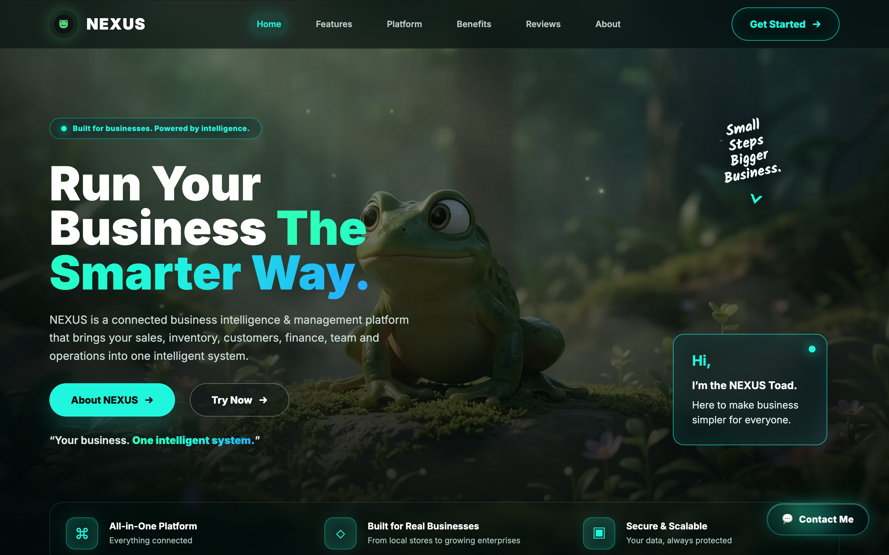

<div align="center">

# 🌐 NEXUS — Cinematic Scroll Experience & Web Showcase

[](https://github.com/aaddi1/NEXUS)

**Ultra-Smooth 24fps 1080p Scroll-Driven Frame Animation & Liquid Glassmorphism Showcase**

[](https://aaddi1.github.io/NEXUS-Webpage/)
[](https://github.com/aaddi1)
[](https://www.linkedin.com/in/aryan-sharma11/)
[](https://x.com/aaddi1)
[](https://www.instagram.com/aryansharma.dev/)
[](mailto:aaddisharmarkczw@gmail.com)
[](LICENSE)

<br/>

<p align="center">
  <a href="https://aaddi1.github.io/NEXUS-Webpage/" target="_blank">
    
  </a>
</p>

</div>

---

## ⚡ Overview

The **NEXUS Webpage** is a high-performance, cinematic web interface engineered to showcase the [NEXUS Enterprise Operations Platform](https://github.com/aaddi1/NEXUS). Built from the ground up with pure Vanilla JavaScript, hardware-accelerated HTML5 Canvas, and advanced CSS Grid/Flexbox glassmorphism, it delivers a zero-latency, tactile interactive presentation.

🔗 **Live Deployment**: [https://aaddi1.github.io/NEXUS-Webpage/](https://aaddi1.github.io/NEXUS-Webpage/)  
📦 **Webpage Source**: [https://github.com/aaddi1/NEXUS-Webpage](https://github.com/aaddi1/NEXUS-Webpage)  
🚀 **NEXUS Platform Core**: [https://github.com/aaddi1/NEXUS](https://github.com/aaddi1/NEXUS)

---

## 🔬 Core Architectural Innovations

### 🎬 1. Linear-Interpolated (LERP) 24fps Canvas Frame Engine
- Renders **239 ultra-high-definition (1080p) lossless WebP frames** directly onto an HTML5 Canvas synced to scroll position.
- Smooth damping physics (`LERP = 0.10`) decouples raw wheel scroll events from frame transitions, creating cinematic buttery-smooth scrubbing at native screen refresh rates (60Hz / 120Hz).
- Viewport cover scaling algorithm calculates aspect-ratio math in real time to fit screens of any geometry.

### 🛡️ 2. Zero-Flicker Progressive Preloader & Nearest-Frame Fallback
- Progressively preloads frames in background queues while instantly serving the initial frame.
- Bidirectional search (`offset ± 1`) dynamically resolves nearest loaded frames during rapid scrubbing, eliminating black flashes and layout shifts.

### 🫧 3. Liquid Glassmorphism & Cyber Emerald Design System
- Frosted glass containers featuring `backdrop-filter: blur(20px) saturate(190%)` paired with radial chromatic glows (`#00F5E4`, `#2CFFC1`, `#28B9FF`).
- **Floating Liquid Glass Contact Widget**: Fixed interactive action button with a glowing radial aura and an animated vertical spring pop-up stack revealing direct social channels with tooltips.
- **Interactive MacBook Presentation Unit**: Precision vector device frame simulating the live NEXUS Enterprise ERP workspace.

### 🚀 4. Zero-Dependency Native Architecture
- Zero bloated external UI frameworks — 100% lightweight, hand-crafted DOM and CSS.
- Dedicated standalone Node.js HTTP server with native MIME resolution, security directory containment guards, and immutable asset caching (`max-age=31536000`).

---

## 📁 Repository Structure

```tree
NEXUS-Webpage/
├── assets/
│   ├── toad-seal.svg           # NEXUS Official Emblem Seal (Vector)
│   ├── avatar.png              # Aryan Sharma Author Portrait
│   ├── nexus-portal.png        # NEXUS Dashboard Screen Capture
│   ├── thumbnail.png           # 2880x1800 4K Retina Webpage Preview
│   ├── raghav.jpg              # Testimonial Avatar (Raghav Malhotra)
│   ├── sneha.jpg               # Testimonial Avatar (Sneha Iyer)
│   └── arjun.jpg               # Testimonial Avatar (Arjun Patel)
├── frames/                     # 239 Lossless 1080p WebP Animation Frames
│   ├── frame_000000.webp
│   └── ...
├── app.js                      # Canvas Animation Loop & Contact Widget Engine
├── style.css                   # Liquid Glassmorphism & Responsive Cyber UI
├── index.html                  # Semantic HTML5 Layout & OpenGraph Architecture
├── server.js                   # High-Performance Node.js Static Server
├── favicon.svg                 # Vector Scalable Favicon
├── package.json                # Project Manifest & Run Scripts
├── LICENSE                     # All Rights Reserved Software License
└── README.md                   # Technical Documentation
```

---

## 🛠️ Quickstart & Execution

### 🌐 Instant Live Access (No Installation Required)
Experience the full cinematic interactive application instantly in your browser:
👉 **[https://aaddi1.github.io/NEXUS-Webpage/](https://aaddi1.github.io/NEXUS-Webpage/)**

---

### 💻 Local Development Setup

#### Prerequisites
- Node.js `v18.0.0+` (or any modern web server / Python HTTP server)

#### 1. Clone the Repository
```bash
git clone https://github.com/aaddi1/NEXUS-Webpage.git
cd NEXUS-Webpage
```

#### 2. Launch Local Server
```bash
npm start
# or
node server.js
```

#### 3. Open in Browser
Navigate to **`http://localhost:3000`**

---

## 👨💻 About the Author & Connect

<table align="center" width="100%">
  <tr>
    <td width="140" align="center" valign="top">
      
    </td>
    <td valign="top">
      <h3>Aryan Sharma</h3>
      <p><em>Student, Software Engineer & Creator of NEXUS</em></p>
      <p>Passionate about building ultra-fast full-stack systems, predictive commercial operations intelligence, and interactive zero-latency web experiences.</p>
      <p>
        <a href="mailto:aaddisharmarkczw@gmail.com"></a>
        <a href="https://github.com/aaddi1" target="_blank"></a>
        <a href="https://www.linkedin.com/in/aryan-sharma11/" target="_blank"></a>
        <a href="https://x.com/aaddi1" target="_blank"></a>
        <a href="https://www.instagram.com/aryansharma.dev/" target="_blank"></a>
        <a href="https://github.com/aaddi1/NEXUS" target="_blank"></a>
      </p>
    </td>
  </tr>
</table>

### 📬 Direct Channels & Profiles

- ✉️ **Primary Email**: [aaddisharmarkczw@gmail.com](mailto:aaddisharmarkczw@gmail.com)
- 🐙 **GitHub Profile**: [@aaddi1](https://github.com/aaddi1) (`https://github.com/aaddi1`)
- 💼 **LinkedIn Profile**: [Aryan Sharma](https://www.linkedin.com/in/aryan-sharma11/) (`https://www.linkedin.com/in/aryan-sharma11/`)
- 𝕏 **X (formerly Twitter)**: [@aaddi1](https://x.com/aaddi1) (`https://x.com/aaddi1`)
- 📸 **Instagram**: [@aryansharma.dev](https://www.instagram.com/aryansharma.dev/) (`https://www.instagram.com/aryansharma.dev/`)
- 🚀 **Flagship Platform Repository**: [NEXUS Enterprise Operating System](https://github.com/aaddi1/NEXUS)

---

## 📜 License

**All Rights Reserved.**  
Copyright © 2026 Aryan Sharma / NEXUS.  
Unauthorized copying, modification, distribution, or public display of this codebase and associated media assets without written permission is strictly prohibited. See [LICENSE](LICENSE) for full details.
